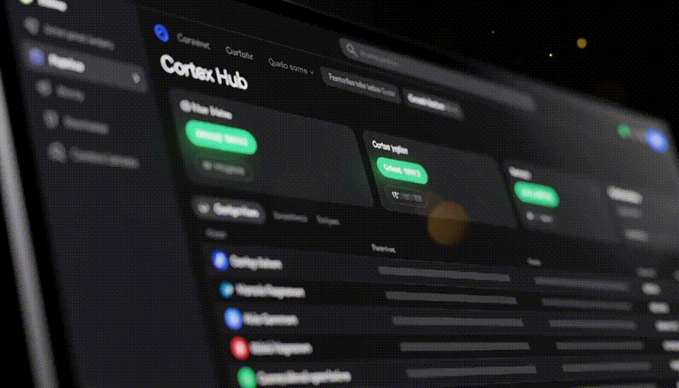
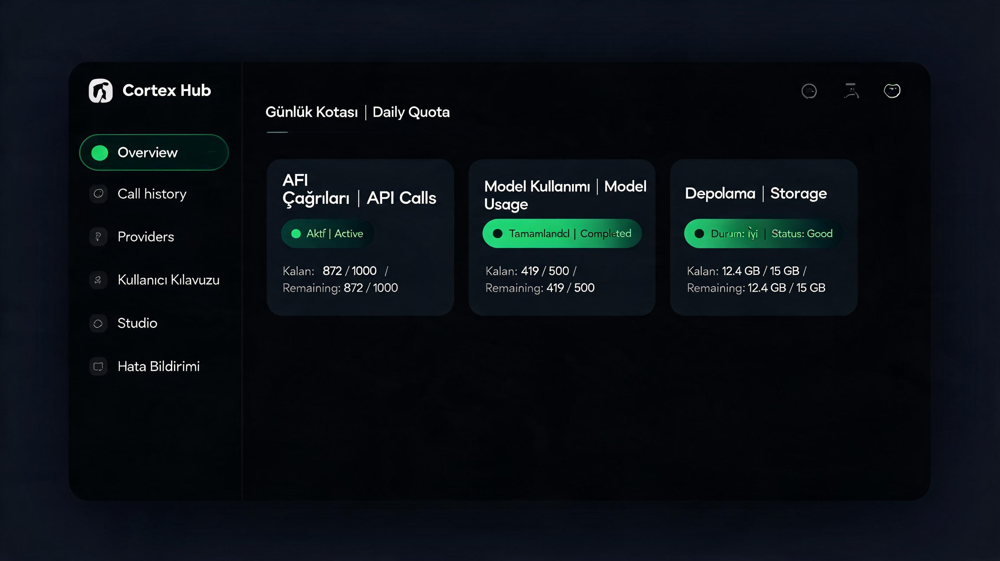
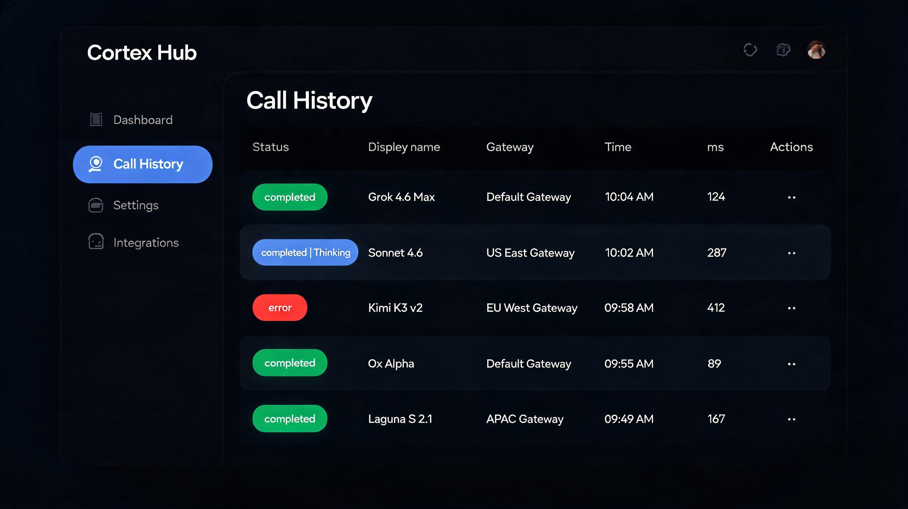
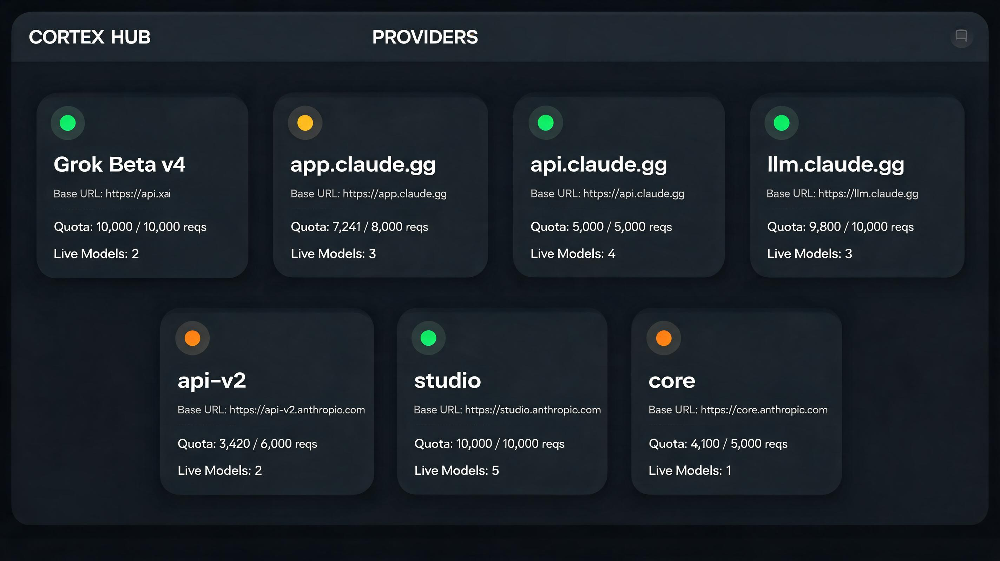
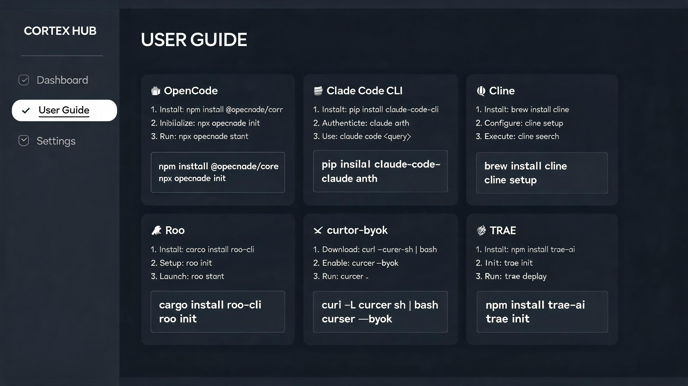
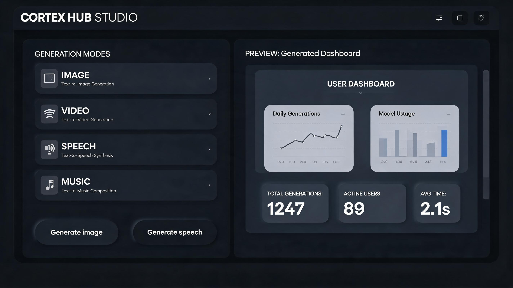
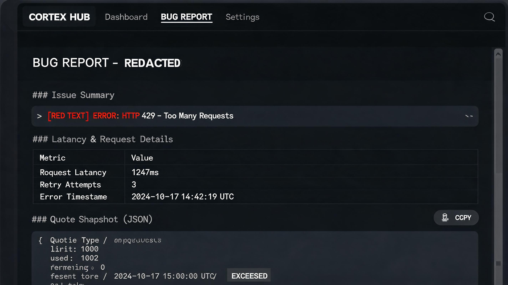

# Cortex Hub

**Tek anahtar. Bütün CortexAI uçları. Kurulum + canlı probe + hata raporu + medya stüdyosu.**

Yeni gelenler “hangi endpoint, hangisi çalışıyor, nereye yapıştırılır” diye takılmasın diye. Çalışanlar 402/503’ü forumda **anahtarsız markdown** ile bildirsin diye.

> CortexAI aboneliği **kişisel kullanım**. Bu repo anahtar paylaşmaz, proxy satmaz, Cursor protokolünü taklit etmez.

[](docs/probe-2026-08-25.json)
[](LICENSE)
[](https://www.python.org/)

<p align="center">
  
</p>

<p align="center">
  <a href="docs/assets/voiceover.mp3">Türkçe sesli tanıtım</a>
  ·
  <a href="docs/assets/theme-preview.mp3">Tema müziği (18 sn)</a>
  ·
  <a href="docs/assets/trailer.mp4">5 sn video</a>
</p>

---

## Ne işe yarar

| Sorun | Hub cevabı |
|-------|------------|
| Yeni üye uçları karıştırıyor | **Providers** + **User guide** (OpenCode, Claude Code, Cowork, Cline, Roo, cursor-byok, TRAE) |
| “Bu model ölü mü?” | **Tüm modelleri dene** → Call history (`completed` / `error`, ms) |
| Forumda bug anlatmak zor | **Rapor** → kırmızı anahtar yok, kota anlık görüntüsü var |
| Görsel / video / ses ayrı API | **Studio** + MCP araçları (`cortex_image`, `cortex_video`, `cortex_speech`, `cortex_music`) |

**Beyin (ajan):** `grok-4.6-max` @ `https://grok-beta-v4.claude.gg`  
**Yedek:** `claude-sonnet-4-6-thinking` @ `https://app.claude.gg`  
**Araçlar:** studio + core + api-v2 web search (5000/gün)

Bu, [cursor-byok](https://github.com/leookun/cursor-byok) klonu **değil**. cursor-byok Cursor’ın kapalı backend’ini yerelde taklit eder. Hub, Cortex katalog/kota/probe/rapor + native config snippet üretir; cursor-byok’a **preset JSON** verir.

---

## Ekranlar

| Overview | Call history | Providers |
|----------|--------------|-----------|
|  |  |  |

| User guide | Studio | Bug report |
|------------|--------|------------|
|  |  |  |

---

## 60 saniyede çalıştır

```bash
git clone https://github.com/esN2k/cortex-hub.git
cd cortex-hub
copy .env.example cortex.env   # Windows
# cp .env.example cortex.env  # macOS/Linux
```

`cortex.env` içine [cortexai.io](https://cortexai.io) anahtarını yaz:

```
CORTEX_API_KEY=sk-...
```

```bash
# Windows
hub\start.cmd

# macOS / Linux
python3 hub/server.py
```

Tarayıcı: **http://127.0.0.1:3848/**

1. Overview → kota yeşil mi  
2. **Tüm modelleri dene**  
3. Kırmızı satır → **Rapor** → kopyala → Discord  

OpenCode’a da basmak için: `scripts\install.ps1` (Windows) veya `scripts/install.sh`.

---

## Mimari

```
OpenCode / Claude Code / Cline / Roo / TRAE / cursor-byok
        │  native config  (snippet / install.ps1)
        ▼
   Cortex Hub  :3848     MCP stdio (mcp/server.py)
        │                      │
        └──────────┬───────────┘
                   ▼
     tek CORTEX_API_KEY  →  *.claude.gg
     grok-beta-v4 · app · api · llm · llm-v2 · api-v2 · studio · core
```

| Klasör | İçerik |
|--------|--------|
| `hub/` | Yerel panel (kota, probe, kılavuz, studio, rapor) |
| `mcp/` | 11 MCP aracı — görsel, video, TTS, müzik, arama, kota, chat |
| `plugins/` | OpenCode: api-v2 websearch + Grok→Sonnet fallback |
| `config/opencode.json` | Grok Max ana, Sonnet yedek, tüm sağlayıcılar |
| `examples/` | Cline / Claude Code / cursor-byok preset (anahtarsız) |
| `docs/` | Uç haritası, istemci kılavuzu, probe kanıtı |

---

## Uçlar ve kota

Sıfırlama: **her gün 03:00 Europe/Istanbul**.

| Uç | Rol | Günlük |
|----|-----|--------|
| `grok-beta-v4.claude.gg` | Ana ajan (Grok 4.6 Max) | beta havuz |
| `app.claude.gg` | Yedek ajan (Sonnet 4.6 thinking) | 2500 · 1000/saat |
| `claude.gg` | Saf Sonnet | 2500 |
| `api.claude.gg` | GPT / Grok-4 / DeepSeek / Gemini | 4000 |
| `llm.claude.gg` | Kimi / Qwen / GLM | 2500 |
| `llm-v2.claude.gg` | Kimi K3 v2 kısayol | 2500 |
| `api-v2.claude.gg` | Ox / Laguna / Muse + **web search 5000** | playground + search |
| `studio.claude.gg` | Görsel / müzik (OpenAI-style) | 500 medya |
| `core.claude.gg` | Video / görsel / TTS / müzik (iş kuyruğu) | 1000 medya + 2500 metin |

Ayrıntı: [docs/gateways.md](docs/gateways.md) · [docs/clients.md](docs/clients.md)

---

## MCP araçları (22)

OpenCode ve Claude Code stdio — tam liste: [docs/mcp.md](docs/mcp.md)

Arama `web_search` + `fetch` · kota / `status` / katalog / `model_schema` · `enhance_prompt` (ücretsiz helper) · görsel (+ referans) · `edit` · video (H3 / wan-2-6 / ilk kare) · TTS · `voice_design` / `voice_clone` · müzik · `lyrics` · `sfx` · upload / job · `chat` · **`jury`** (Grok+Sonnet+Ox) · **`embed`**

Ajan: «şu görseli üret», «arkaplanı sil», «bu kareden video», «üç modele sor», «kota».

Çıktı: `cortex-out/` (gitignore).

---

## Canlı probe (2026-08-25)

`python scripts/probe.py` — Hub gerekmez.

| Model | HTTP | ms | Sonuç |
|-------|------|----|--------|
| Grok 4.6 Max | 200 | 4711 | completed |
| Sonnet 4.6 Thinking | 200 | 2764 | completed |
| Sonnet 4.6 | 200 | 2707 | completed |
| Ox Alpha | 200 | 7232 | completed |
| Kimi K3 v2 | 402 | 15129 | error — raporla |
| Laguna S 2.1 | 503 | 1975 | error — raporla |
| Kimi K3 | 503 | 6299 | error — raporla |

Ham JSON: [docs/probe-2026-08-25.json](docs/probe-2026-08-25.json)

402/503 **ürün hatası değil**, uç sağlığı. Hub’ın Call history + Bug report tam bunun için.

Medya (aynı gün, core): görsel seedream-5, video minimax-h3 5 sn, TTS speech-2-8-hd, müzik music-3 — hepsi `success`.

---

## İstemciler (kısa)

| Uygulama | Ne yapıştırılır |
|----------|-----------------|
| **OpenCode** | `scripts/install.ps1` veya `config/opencode.json` |
| **Claude Code CLI** | `examples/claude-code.env.json` → `~/.claude/settings.json` `env` |
| **Claude Desktop / Cowork** | Developer → Third-Party Inference → `https://app.claude.gg` + `claude-sonnet-4-6-thinking` |
| **Cline** | Anthropic + custom base `https://app.claude.gg` |
| **Roo / Zoo** | OpenAI Compatible `https://grok-beta-v4.claude.gg/v1` · `grok-4.6-max` |
| **cursor-byok** | `examples/cursor-byok-preset.json` (anahtarı sen yapıştırırsın) |
| **TRAE** | Custom Config · Anthropic Messages · `https://app.claude.gg` |

Adım adım: [docs/clients.md](docs/clients.md)

---

## Güvenlik

- `cortex.env` gitignore. Issue/PR’ye `sk-` yapıştırma.
- Bug report anahtarı maskeler; prompt göndermez.
- Abonelik kişisel: bu yazılımı çok kullanıcılı proxy yapma.

[SECURITY.md](SECURITY.md)

---

## Geliştirme

```bash
python mcp/smoke.py          # katalog + web search (medya kotası yok)
python scripts/probe.py      # model ping
python hub/server.py         # panel
```

Katkı: [CONTRIBUTING.md](CONTRIBUTING.md) · [AGENTS.md](AGENTS.md)

---

## Lisans ve ilişki

MIT. **CortexAI / Cursor / Anthropic / xAI ile resmi bağı yok.**  
API’ler [cortexai.com.tr](https://cortexai.com.tr) belgelerine göre; uçlar BETA — kesinti ve model değişimi olabilir.

---

## Discord’a atmak için

```
Cortex Hub — tek anahtar, bütün uçlar.
Kurulum paneli + canlı probe + anahtarsız bug report + görsel/video/ses.
https://github.com/esN2k/cortex-hub
```
